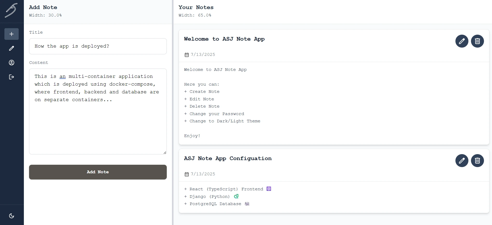

# ASJ Note App 📝

Asj Note App is a simple web application for taking short notes. It is a full-stack application built using React (TypeScript) as Frontend with TailwindCSS for styling, Django-Rest-Framework as Backend, PostgreSQL for Database and Deployment on Docker. 



This project is made to improve my knowledge on React, Django and deploying and managing multi-container applications using Docker Compose.

## Tech Stack

<table align="center">
  <tr>
    <td align="center" width="200">
     
   </td>
   <td align="center">Frontend</td>
  </tr>
  <tr>
    <td align="center" width="200">
     
   </td>
   <td align="center">Backend</td>
  </tr>
  <tr>
    <td align="center" width="200">
     
   </td>
   <td align="center">Database</td>
  </tr>
  <tr>
    <td align="center" width="200">
     
   </td>
   <td align="center">Deployment</td>
  </tr>
</table>

## Core Features

- 🔒 **Basic Authentication** with JWT Tokens (SignUp/Login).
- 💻 **Desktop Optimised UI** with readjustable panels.
- 📝 **Basic Note operations** (Add, Edit, and Delete Note).
- 🌓 **Dark and Light Theme** Support.

## Implementation

### Frontend
- Built on **React** + **TypeScript** in **Vite** development environment.
- **React Router DOM** for routing.
- **Axios** for communication with the API backend.
- **Tailwind CSS** for styling.
- **Zustand** for Global State Management.
- Uses **NGINX** server in production.

### Backend
- **Python** based backend using **Django**.
- Acts as an API using **Django-Rest-Framework**.
- Uses **JWT tokens** for secure authentication and validating sessions using **Django Simple JWT**.
- Uses **psycopg** for communication with the database.
- Uses python **gunicorn** server in production.

### Database
- Uses **PostgreSQL 17** for database.
- The psycopg interface in backend does the communication with the db.


### Deployment (OPERATION SMILING WHALE 🐳)
- **Docker Compose** is used to deployement.
- Uses a multi-container structure dividing the application into three containers.
    - 🐘 **DB container:**
        - Starts first
        - Uses a ```postgres17:alpine``` image.
        - Takes an healthcheck if it is set up correctly.
    - 🐍 **Backend conatiner:**
        - Starts only after DB container is ready.
        - Uses a ```python:3.12alpine``` image.
        - Runs migrations and takes an healthcheck if it is set up correctly.
    - ⚛️ **Frontend container:**
        - Starts only after Backend container is ready.
        - Uses a ```node:20-alpine``` image as builder to compile the react files to static files.
        - Then uses an ```nginx:alpine``` image to serve these static files in an nginx server.
        - It also ensures the setup is free from cors issues when communicating with the backend.


## How to Run this Project?

**Prerequisite:** Make sure you have [Docker](https://www.docker.com/) installed in your computer and is running without any issues.

**Step 1:** Download or clone this repository to a folder.

**Step 2:** Navigate to the project folder in your terminal/command prompt.

**Step 3:** Build the Application.

```shell
docker-compose build
```

Have a cup of coffee 🍵 while Docker builds the images for frontend and backend.

**Step 4:** Start the Containers.

Run the command
```shell
docker-compose up
```

Check if the three containers are running

On a new terminal, run

```shell
docker ps -all
```

Find the below containers are running or not

```shell
CONTAINER ID   IMAGE                       COMMAND                  CREATED         STATUS                     PORTS                    NAMES
bf17ed4826a3   note-app-backend            "/app/entrypoint.sh"     2 minutes ago   Up 2 minutes (unhealthy)   0.0.0.0:8000->8000/tcp   backend
f0c31f44425c   note-app-frontend-nginx     "/docker-entrypoint.…"   2 minutes ago   Created                                             frontend
361a2d2f88fd   postgres:17-alpine3.22      "docker-entrypoint.s…"   2 minutes ago   Up 2 minutes (healthy)     5432/tcp                 db

```

Start the frontend container if its status is ```Created```

```shell
docker start frontend
```

**Step 5:** If all containers running properly, open your browser and navigate to port 80

```shell
localhost:80
```

Sign Up with some random credentials and start testing the app out 😊.

## References I used for making this project

- **Docker Docs** 
    - [Multi Stage | Docker Docs](https://docs.docker.com/build/building/multi-stage/)
    - [Docker Compose | Docker Docs](https://docs.docker.com/compose/)
- **Django Documentation**
    - [Databases | Django Documentation](https://docs.djangoproject.com/en/5.2/ref/databases/)
    - [Django Settings | Django Documentation | Django](https://docs.djangoproject.com/en/5.2/topics/settings/)
- **Django-Rest-Api Docs**
    - [1 - Serialization - Django REST framework](https://www.django-rest-framework.org/tutorial/1-serialization/)
    - [2 - Requests and Responses - Django REST framework](https://www.django-rest-framework.org/tutorial/2-requests-and-responses/)
- **PostgreSQL Documentation**
    - [PostgreSQL:Documentation](https://www.postgresql.org/docs/)
    - [PostgreSQL Tutorial | W3Schools](https://www.w3schools.com/postgresql/)
- **References for Frontend**
    - [Vite](https://v6.vite.dev/guide/)
    - [Zustand](https://zustand-demo.pmnd.rs/)
    - [Tailwind CSS](https://tailwindcss.com/docs/installation/using-vite)
    - [Axios](https://axios-http.com/docs/intro)
    - [Nginx](https://nginx.org/en/docs/)
- **You-Tube References**
    - [Django & React Web App Tutorial - Authentication, Databases, Deployment & More... by Tech With Tim](https://youtu.be/c-QsfbznSXI?si=BaIYMmXUWeS0KYUl)
    - [Django REST Framework - Build an API from Scratch by Caleb Curry](https://youtu.be/i5JykvxUk_A?si=m-pkwYXObmeRJFoP)
    - [Docker + Django: Containerize the Right Way with Nginx, Postgresql & Gunicorn by Better Stack](https://youtu.be/1v3lqIITRJA?si=kNNEARpNdTmk3QcN)

I've also used ChatGPT and Claude for optimising CSS,  debugging and understanding console errors.